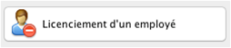

# Exercice 11 : Gestion des employés
## durée : 240'
## Objectifs visés :
Maîtrise de MVC ; Maitriser les diagrammes de séquence ; Maitriser les diagrammes de classes ; Savoir se référer à la Javadoc.

## Travail à réaliser
Lisez avec attention les informations fournies ci-après sous diverses formes (diagramme de classe, javadoc, diagrammes de séquence, …) car vous y trouverez toutes les informations utiles afin de finaliser le projet Java NetBeans « **GestionEmployes** ».

## Résultat à obtenir
Si votre code est correctement implémenté selon les directives reçues, vous devriez obtenir une application fonctionnelle ressemblant à cela :


## Description des fonctionnalités de l'application
Les boutons permettant d’activer les différentes fonctionnalités de l’application sont automatiquement activés et désactivés de manière à ne permettre que les actions qui font sens (par exemple un employé qui est déjà en vacances ne peut plus être mis en vacances).

| Les boutons ci-dessous permettent de : | Confirmation en cas de réussite | Confirmation en cas d’échec|
|:---|:---:|:---:|
| <br>Permet d’engager l’employé dont le nom et prénom ont été saisis. ||| 
| <br>Permet de licencier l’employé sélectionné dans la liste||Le bouton est désactivé s’il n’y a aucun employé sélectionné. Aucune erreur ne devrait donc pouvoir se produire.|
| <br>Permet de mettre en vacances l’employé sélectionné dans la liste||Le bouton est désactivé s’il n’y a aucun employé sélectionné ou s’il est déjà en vacances. Aucune erreur ne devrait donc pouvoir se produire.|
| <br>Permet de remettre au travail l’employé sélectionné dans la liste||Le bouton est désactivé s’il n’y a aucun employé sélectionné ou s’il n’est pas en vacances. Aucune erreur ne devrait donc pouvoir se produire.|
| <br>Permet de saisir un timbrage de début de travail pour l’employé sélectionné dans la liste||Le bouton est désactivé s’il n’y a aucun employé sélectionné ou s’il a déjà timbré son début de travail. Aucune erreur ne devrait donc pouvoir se produire.|
| <br>Permet de saisir un timbrage de fin de travail pour l’employé sélectionné dans la liste||Le bouton est désactivé s’il n’y a aucun employé sélectionné ou s’il a déjà timbré sa fin de travail. Aucune erreur ne devrait donc pouvoir se produire.|
| <br>Permet de quitter l’application||L’application quittera si l’utilisateur répond « Oui ». S’il choisit « Non », la fenêtre sera fermée sans conséquences.|

**Autres boutons** :

 <br>Affiche un rapport de tous les timbrages de l’employé sélectionné dans la liste. Un résultat tel que ci-dessous sera produit dans la partie « Rapport » :
```
----------------------------------------------
Timbrages de TERRIEUR Alex
----------------------------------------------
Début du travail le 2016/04/24 21:22:56
Fin du travail le 2016/04/24 21:23:24
Début du travail le 2016/04/24 21:23:26
Fin du travail le 2016/04/24 21:23:33
Début du travail le 2016/04/24 21:23:34
Fin du travail le 2016/04/24 21:23:37
Début du travail le 2016/04/24 21:32:33
Fin du travail le 2016/04/24 21:32:43
Début du travail le 2016/04/24 21:45:51
Fin du travail le 2016/04/24 21:45:57
----------------------------------------------
En conséquence ses périodes de travail sont :
----------------------------------------------
2016/04/24 de 21:22:56 à 21:23:24 => 28 secondes
2016/04/24 de 21:23:26 à 21:23:33 => 7 secondes
2016/04/24 de 21:23:34 à 21:23:37 => 3 secondes
2016/04/24 de 21:32:33 à 21:32:43 => 10 secondes
2016/04/24 de 21:45:51 à 21:45:57 => 7 secondes
----------------------------------------------
Total du travail réalisé pour la paie : 00:00:55
```
---
 <br>Affiche un rapport de tous les employés de l’entreprise et leurs détails. Un résultat tel que ci-dessous sera produit dans la partie « Rapport » :
```
----------------------------------------------
Employés de l'entreprise
----------------------------------------------
BERNASCONI Maria, au travail, engagé le 2016/04/24
HARONI Mac, en vacances, engagé le 2016/04/24
D'OEUF John, au travail, engagé le 2016/04/24
TERRIEUR Alain, au travail, engagé le 2016/04/24
TERRIEUR Alex, au travail, engagé le 2016/04/24
```
---
 <br>Affiche un rapport de tous les employés de l’entreprise qui sont disponibles pour travailler. Un résultat tel que ci-dessous sera produit dans la partie « Rapport » :
```
----------------------------------------------
Employés disponibles
----------------------------------------------
BERNASCONI Maria
D'OEUF John
TERRIEUR Alain
TERRIEUR Alex
```
---
 <br>Affiche un rapport de tous les employés de l’entreprise qui sont en vacances. Un résultat tel que ci-dessous sera produit dans la partie « Rapport » :
```
----------------------------------------------
Employés en vacances
----------------------------------------------
HARONI Mac
```
---


## Diagramme de classes


## Diagramme de classes : le service "Employe" et les modèles


### Structure des packages Java
Voici la structure des packages pour chaque classe du projet

### Diagramme de séquence
Voici le diagramme de séquence de la méthode de la méthode `main()` de la classe `Application` du package `app` :

### Javadoc
Vous pouvez cliquer sur [ce lien pour obtenir la JavaDoc en HTML](javadoc/index.html) de l'application **GestionEmployes**.
